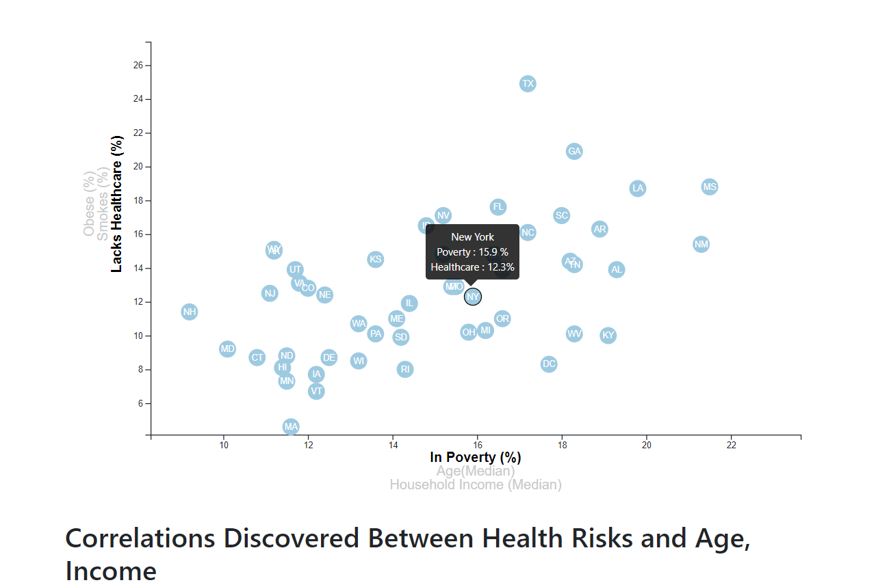
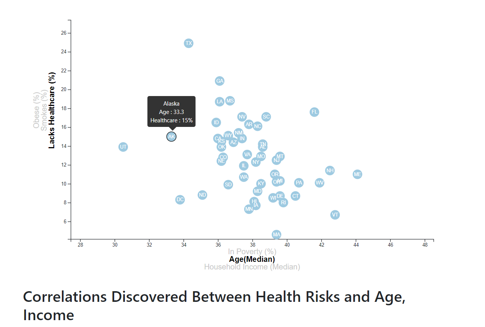
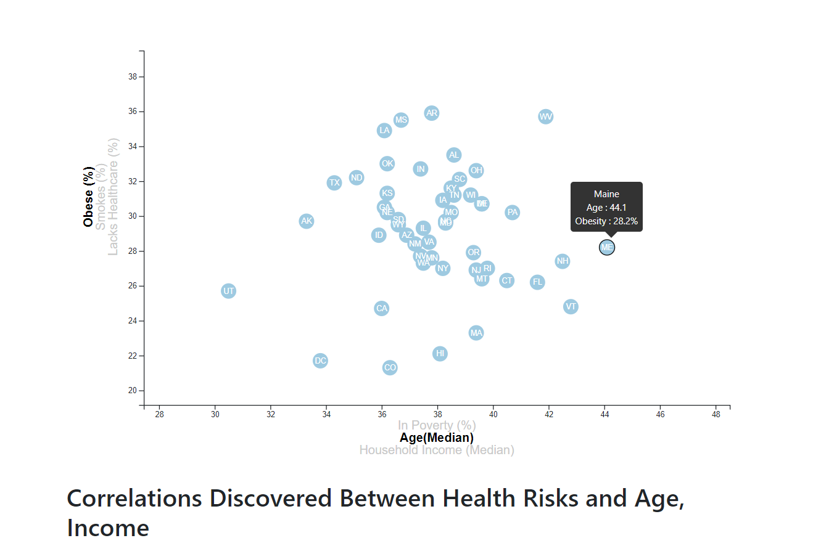

# D3-Challenge

## Introduction

This is my submission for the D3.js homework

## Structure
```
|_assets
	|_css
		|_d3Style.css
		|_style.css
	|_data
		|_data.csv
	|_js
		|_app.js
|_.gitignore
|_README.md
|_index.html

```

## Usage
```
#The page was created using:
HTML5
CSS W3
Bootstrap 4.3.1
JavaScript ES6
D3.js

```

## Summary

When the [data visualisation page](https://fernb.github.io/D3-Challenge/) is loaded, the graph is intialised using the first axis selections.



On hovering over each data point the border of the point is highlighted and a tooltip containing the state, x and y data is revealed.

On selecting a different x or y axis label the dataset is changed to match the label name. The axes are rescaled accordingly.




